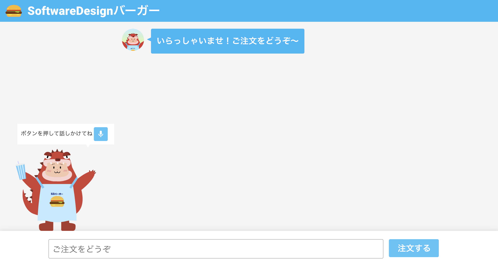

# dialogflow-bot-demo

## ディレクトリ構造

dialogflow-bot-demo/  
┣ api/ - API 関連ソース。  
┃ ┣ node_modules/ - npm パッケージのインストールフォルダ。  
┃ ┣ index.js – API のメインファイル。API のメインの処理を記載している。  
┃ ┣ package.json – プロジェクトの設定や npm パッケージの依存関係が記載されている。  
┃ ┣ package-lock.json – インストールされた npm パッケージのバージョンが記載されている。  
┣ node_modules/ – Vue.js の npm パッケージのインストールフォルダ。  
┣ public/ - Vue.js で使用する画像などの静的ファイルを配置  
┣ src/ - フロント処理関連のソース  
┃ ┣ plugins/ - プラグインを配置  
┃ ┃┣ vueify.js – Vuetify(UI フレームワーク)の読み込み  
┃ ┣ App.vue – フロント画面のメインファイル。フロント画面のメインの処理を記載している。  
┃ ┣ main.js – Vue.js のエントリーポイント  
┣ package.json – Vue.js のプロジェクトの設定や npm パッケージの依存関係が記載されている。  
┣ package-lock.json – Vue.js のインストールされた npm パッケージのバージョンが記載されている。  
┣ vue.config.js – Vue.js の config ファイル

## フロント側 npm モジュールインストール

```
npm install
```

### フロント側開発サーバ立ち上げ

```
npm run serve
```

## Dialogflow API 使用設定のクイックスタート

https://cloud.google.com/dialogflow/es/docs/quick/setup?hl=ja

## Dialogflow のサービスアカウントキーの設定

```
export GOOGLE_APPLICATION_CREDENTIALS="[キーのPATH]"
```

## Dialogflow のプロジェクト ID を追記

api/index.js の以下の行の'PROJECT ID'を自分のプロジェクト ID に変更

```
const sessionPath = sessionClient.projectAgentSessionPath('PROJECT ID', req.query.sessionId);
```

## API 側 npm モジュールインストール

```
cd api
npm install
```

## API 側開発サーバ立ち上げ

```
npm start
```

## サンプル画面

http://localhost:8080/


